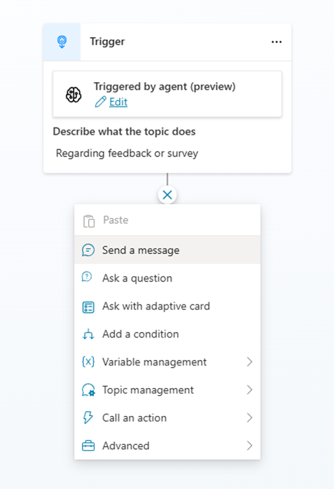
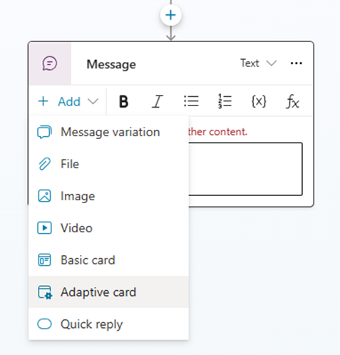
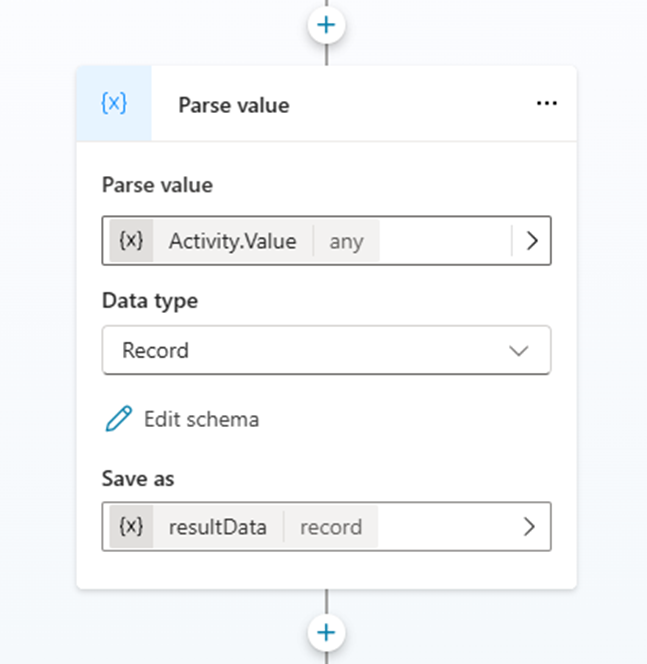
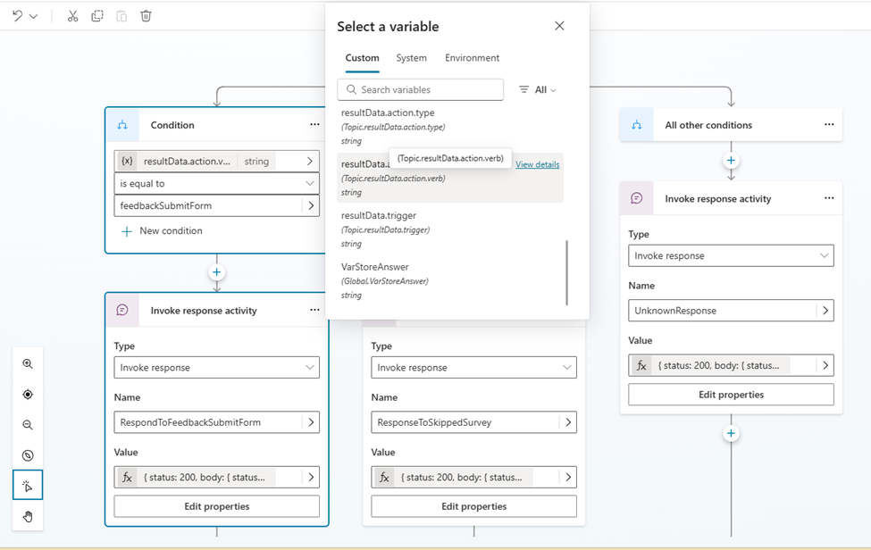

# Adaptive Card Form in Microsoft Copilot Studio: How to Enable Refresh for Better User Experience

Adaptive Cards are a powerful tool in Microsoft Copilot Studio that enhances user experience by providing interactive elements like buttons and forms.
When using the **"Ask with Adaptive Card"** feature, you can collect user responses and proceed to the next step. However, the card remains static and doesn't refresh to indicate form completion. Microsoft Copilot Studio prevents users from pressing the button again, but to deliver a better experience, you might want to navigate to another card or disable the button.


## Demo


## Steps
Here is how you can achieve this with Universal Actions for Adaptive Cards:

**Step 1: Create an Adaptive Card Design** 
* Start by designing your Adaptive Card using https://adaptivecards.io/designer/ or https://dev.teams.microsoft.com/cards 
*	Use **Action.Execute**: Instead of **Action.Submit**, use **Action.Execute** to send events to the agent. Ensure each event has a unique **verb** to handle it later in Microsoft Copilot Studio. Check out the example of Adaptive Cards with Action.Execute here https://learn.microsoft.com/en-us/adaptive-cards/authoring-cards/universal-action-model#actionexecute 

**Step 2: Create a Topic in Your Agent to display the Adaptive Card** 



For example, you can send a survey input card.
``` json
{
    "type": "AdaptiveCard",
    "$schema": "https://adaptivecards.io/schemas/adaptive-card.json",
    "version": "1.5",
    "body": [
        {
            "type": "Container",
            "items": [
                {
                    "type": "ColumnSet",
                    "columns": [
                        {
                            "type": "Column",
                            "width": "auto",
                            "items": [
                                {
                                    "type": "Icon",
                                    "name": "TaskListSquareRtl",
                                    "size": "Small"
                                }
                            ],
                            "spacing": "Small"
                        },
                        {
                            "type": "Column",
                            "width": "stretch",
                            "spacing": "Small",
                            "items": [
                                {
                                    "type": "TextBlock",
                                    "text": "Survey",
                                    "wrap": true,
                                    "weight": "Bolder"
                                }
                            ],
                            "verticalContentAlignment": "Center"
                        }
                    ]
                }
            ],
            "showBorder": false
        },
        {
            "type": "Container",
            "separator": true,
            "spacing": "Medium",
            "items": [
                {
                    "type": "TextBlock",
                    "text": "Experience Feedback",
                    "wrap": true,
                    "size": "Large",
                    "weight": "Bolder"
                }
            ]
        },
        {
            "type": "Input.Rating",
            "isRequired": true,
            "errorMessage": "Please select rating stars.",
            "id": "ratingStars",
            "color": "Marigold",
            "label": "How was your overall experience?"
        },
        {
            "id": "txtComments",
            "type": "Input.Text",
            "placeholder": "Provide your comments",
            "isMultiline": true,
            "maxLength": 255,
            "label": "Any other comments?"
        },
        {
            "type": "ActionSet",
            "actions": [
                {
                    "type": "Action.Execute",
                    "title": "Submit",
                    "data": {
                        "actionType": "submitted"
                    },
                    "verb": "feedbackSubmitForm",
                    "fallback": "Action.Submit",
                    "style": "positive"
                },
                {
                    "type": "Action.Execute",
                    "title": "Skip",
                    "data": {
                        "actionType": "skipped"
                    },
                    "associatedInputs": "none",
                    "verb": "feedbackSkipForm",
                    "fallback": "Action.Submit"
                }
            ]
        }
    ]
}

```
**Step 3: Create a Topic to Listen for Activity**
Create a topic in your agent to listen for events in the Adaptive Card. For instance, you can check for the verb "feedbackSubmitForm" and respond with an updated card saying "Thank you for sharing your feedback."

* Add Trigger: Invoke Received
* Create a “Parse value” node to parse value of the Activity JSON from Adaptive card’s event. 

Schema of the Activity.Value (Schema of the activity request format: https://learn.microsoft.com/en-us/adaptive-cards/authoring-cards/universal-action-model#adaptivecardaction-invoke-activity)

``` yaml
kind: Record
properties:
  action:
    type:
      kind: Record
      properties:
        data:
          type:
            kind: Record
            properties:
              userResponse: String

        id: String
        title: String
        tooltip: String
        type: String
        verb: String

  trigger: String
```

* Branch Logic for Different Events based on **resultData.action.verb**: After each condition branch, design different cards to refresh from the previous card. 


* Form the Response: Return the response to the agent in the following format:
``` json
{
"statusCode": 200,
"type": "application/vnd.microsoft.card.adaptive",
"value": "<Refresh Adaptive Card Object>"
}
```
For more details of forming the response format, refer to the Universal Action Model documentation on Microsoft Learn. https://learn.microsoft.com/en-us/adaptive-cards/authoring-cards/universal-action-model#response-format

Example:
``` json
{
  status: 200,
  body: {
    statusCode: 200,
    type: "application/vnd.microsoft.card.adaptive",
    value: {
      type: "AdaptiveCard",
      body: [
        {
          type: "ColumnSet",
          columns: [
            {
              type: "Column",
              items: [
                {
                  type: "Image",
                  url: "data:image/png;base64,iVBORw0KGgoAAAANSUhEUgAAADwAAAA6CAYAAADspTpvAAAACXBIWXMAAAsTAAALEwEAmpwYAAAAAXNSR0IArs4c6QAAAARnQU1BAACxjwv8YQUAAA1QSURBVHgB7VpdbBxXFT5n7vyt7aQbngCBukkRalCFnKqqxBM2T0gI1X1AQrzEFS8gfpoCglIp7BpBEvVHTXkGvBUC+tSkEhW8oLhIqC9ItoSrgkDKhhbRtFVjN4nj3Zl7L9+5d2Z2147dOHEcG3Gku3fmzuzOfPc79/zdZfofkYlj9TpFow2yXKf8ysLc6aWl693HtIdl4lijHqT5o4Axbck03KC1ZNGxpQVr+bm5p/7dHvzOngX8hZ80jq5eM6et0XUGDGvN8A2WPHC2nZjs5B9OvdWR4YD2oEw9c6ipc9MmawBWGDUABjBMrnfCnk0Q3jARnft8q96Q4T0H+Cu/+EQTQFs61wBXAhUuDXllHmhuHEeGG6FKZuV4T6n01357b+PKyur5pbd6tLpiq5e3ZW+dEhcDXJxjQkBrOgKVV3pyTzEcja6co7xHOjNOfT2LvpeOWVYzF2pt3bk7EkOGFime2jOAf/TqR5tkrt2d97pkxD5xCZAqYF6MW8jDoP31MDQP7QnATy7Wx9mutHR3lbOuqKqMFuwWxondBJQAvcV2x2zd2naHATVC2uXSmq/XmbMzlOdQ5YSybJDNYvVy/9BPQF+VKw0A8EDtASt9V5I1Fa02dG5Ja4Y6yyv3QZfgyrXcb8OqHmDRB4FZ2tWAn1kcnSZePSYqKkC1BhQtVwprXInXbbemS5Ds/XOp9ipwDC/sWsAnX683ArXaZNI+anKNK80tWex/9q94zFwZNXFLQWhIKbt7Aad0VcA2KoqINoga7HXPuXBVwjNUmcIIYzk9tysBP7OYTjPl01Wo5KMmq9iztZHw4IyUFhwsh5EVlW63v77U2XWAT86LKutmqaalGxWgDKYCZTf87jqurXGuKoqpY5SZkbFdBzhOes+C3UZx6rQSBtZi/bGKwHJoN/n28DWG45UJYmVnXgC7MrarAD/9tw89GnA2xQO2yYfHliOAjSLiOC7DyhsRQ1HE7Re/+067HNk1gE/Of7hBNoehyq0LGNiv39LLgF2OYk1RAsCbstwX+N6OylYfGxqjXSJBos4F1DsATgfNcgU+igzFqbFJaihJ9Sa/5L8qExWG9MjZ1nCpZ1cAPvn6J8FsrwHA7lwAWnG6AM9FJCGsJonhpKapNgo3E5sNfs0WgQbN/O74W3Nrryq6w9KaH0dy3jsT0vsc8Go5vMa/wECDGsmS8lxZnYF6Ay+dS6g5vKBhp6ABtvPy8YsPX+95dzx5COLoHNiFIcrWXPEpnq2yekniLdVGcs72K4SZuRvtXsMk9LyVE4ucgHmjw8mNnndHAc+89rlmQJcaMFR492xNgGyrZKccUAgPR8Y051kGUBGMUk5itfOcXdgpLgucz/zmG+92NnrmHVPpJxanxsHsC4ovU+jaVSrWrC82lgGxPykng5UqDyV6ctbbJgmxGDKUcTrtry4/vNlz1zE8Pjtfz67Wplev5A8ZbccxVPc/zwvoF0yWzXRaRzp0C3JsfrpOtHImkGqja9r5WqbSWDl+eSDRrYBDbXlkX+4iKAkZk27AkjYW4efEBz17CPADs69PGKrNqpgaUS2n3koXFT9TJGMO/DhH4fShE4unTc8BX6KbkFglCB2v3k0lYDbW15EHsviBDKgsxhUXkPUQVDuXkJGynrFIGxkGbObHn+1d+KBnV2vmwV/OH7Xh6KzlGh4fwRBo6l5eoexad/CBA6/DCzbLHt4q29+aPz6dqvdm4+AiRXSRYn7btZCXqABY6KyosS2p4/WRcjkXzNrQ3Pfus5M38nznhyd+/edxhG5t5/SgJ0EU2zBOKBmrUZQmQ5Zj4FlgOzrXaM036AZl+tVnG8ZEzbKKyEUOVyZ0hRQHdqCkvjZG5op+1KQvwXpP0w2KAxwlyZm4VrNxEiOiUcAcsYojChMPOgTo8k0Gy0c4ajjQP10cv6GH8T6AVY2i2lZA5iqMHJZ1U1wVsBytPo1CKZ6+881D9IGqXL3DF1+efyhJ40aSRJzWIgTnIQJuhfURIpqJHdhkbITCWko0GNVTOQEATXb+nhOLRzd70Jf+9MfpzI4dlTm2Lv/xYK2b8+E6VQnQT8Q65r3ei1FDjvvYYWrTFiRIEzWVgEmwi1g1RqyKPg4AOsB56MajWkKpqDd6SbnWVvxFjLXtQyf/2rzeQyZ+P9/oZWnTmAT2OLHiDT1QJaERECjq7yOUP2u5CC9poEI3WJjrIN2doS0KAp14XEClAJrGISeJAmAW0DYKAboWUjKCCRlJHdPxaCrOcOhHuK/rrUMnX1sHOliNn9V51NDY1TImBRDJ5pU1FkBtBKMTsnUhQd/30lANtt9XbgtxC9jt0BYljOKobhhRCzyUNIWXCKTCJ4UvsJkb+L4A8wrrwMr1COEQ5sN6wzX1QZOffbxQ656Tiw3dzR4Tt/Xgr/7RzPN8SmtUHQ3A0QjC4NQBRcIn4QPIlT7CT/TsOoQ07JKKgee3qsoV4BjqjIdB1UIEeIhRbWDZATYskUyQw+wDPUjlEA5aIdQBYFahomy1S1k3Q+nUZy7WVvnrdFiLpz71s78v6Z5tmJhcmVXCQSR4AD7CJogENLxwAsMTk7SAV9ZYiQqrHQhALgi7dJMSQhYQs8DwABGHViEOCNwWJLvQLVBs88wAtHLFbBUKeASFMGwKLYwzyruywaX7QYqkZ6GqY2LqfgbEDQGwxaQamdwxHKdkAmxVk7REgKMPiYsUkQr/WyQQZcgpC3v62zehyhXgOFSvgMspvL6E8GyMV01RaQnKAyEc59jpcKoMsJ75KEAwH3AOay5NZzkZ7Nka49lWcm9Y1JTcu4qRCos1C4BqDMeXCBluATaVhhszLjfBikTJAS98WAtgX6FbkJBqYTvUqglVrov91caDlSp/UFQLXQ+msd3BuZKsBUsZcSyMmu11M87AtGMYKZsR9Xb/sxBtwG9FojI4k40dxpc5hrFKWdtR0lzDNAvQGjYUarhtBDhXSQoBRSzd3/Bl6jx6782rcinB6YMHlrAiZ8Qih3jBKHSlEfQsBbCiwVpD22IcJyikybUkCpChhJyOJrY2Bl89Ki2FFReLjlZD4JKiofIWYEIKwHhzUenUalsDqBpJn1sJZ0fANAyarcnsWOYqH/bMxDRB2yAueXj6npHT3z+f1cFm04BOTD+5BEQX6u123tgF6blmMWosqhposdhY+ZgAhUnJdWhDuUHWstdBZ/GxL4sSTS6gJcdxRtKA2RwAA/JgNV0DpcJwD7xm8BXX/DYvPpC1zWwlmtpMhsKbx9+wLbxnE7kLiWZqHLhe+/McOLSGWms/ng+OAyiuYQy/4OouPl52SyLo2ji8Ci25jLbMtfA99G9Dsd/kiN+hMHgP9voSh3QJzumSDXmZJZkIqIu3sp1jh+kgbZMMpYenPs6tJ96wsmabzH3j5ZgCeDhRZ8CcQdO+foTNADBNbOC3BHgAI+C2NG25ZekK6TB0KETBrTF8rmFYZpuw5hGAEpa7YDgDwzl+EmrjtgjFUZolMD5J2yjrCgAnCtBY0k2h3xTRrC7WlANoPFhGUKKMZQ31zg303IiqK/cd478oboT9zQDEq5itWAyXs8yyZjXtw+/B2QewiAAJJ4jbtYOMqZ/5weGLHdpG4Y0uPPGmS7lm++rtwbtjW6ixABMVB3AtwF34S1zd79TafYDhHrzwklPVMFiySfAuVPhdd+zUmZdhsZeg0tIvg4nLc8fv+8u2siuyYV36xMe4je4I1HHJ1Y4K9yR96BsiL/G3bNE7yy3nou4SagewTRKOOr+NL4FVlpDShZWIrrSz0GOYmDHsYu63uR2Dhd4Pi41G9Y5WY4/QbZBNC/EAjRoWHUFg1XFAVQFcQLFbDyzAByZD6sfWHcu6dUUq9xcT69JCGnHN0KgHKw0qra20/SjUCvC7KKN6q3V4rkM7DVjk1EHGbNMkwHSUB9IPSAqDFpass2tuAsp7OaAygsC6jG0JNKd9NmcABEgBK0BzWwfYD7WfvG/2ebpNckNbLac+AtABTeLlOxW7BatlX/7PUQ2eA6zyu5ZVRqBdVOVYZdfMPi7UGMDvutDV6S1HU5sJb+Xm1n9sAxHkGRirceP9rzNgujyWvzXqwmh5w+aa1CQlaOnnQXA5fAUTtwxDJgbqfZb6tFLLUz//9JdfotsoW9pMa4HpKKNJsHx2kM3SqLn6BfcZHlgCXKq/F1UYLKfKLOzmdOD07QYrsiWGB+WH/7JtkHdUr2V54NyNWZcus4vWrHdtIrKmJchQ2HFQfOV8j9++/+yRm6tzb0VuGrCIhKIA0CzBDapydQ5gWAay88cC3gyptgguZO8fPPuZAx3aAbml/WEJRZEbzKy12or77stVr7hQdf9HmyG8KAzM7BRYkVtiuJTHL9gW6gNNUVtR2ayIykqm8/Jc98cK1J2XHuCDtIOyLf8AOHU3t1CYeqRiOKh8ta1cFBVuqm+8zuN4gnZYtu0vD08d5DbW7xGA6ZRV29I3ly3oW/E5FD/uf/F+vkA7LNui0mvl2D/tNFT8KNR4HOpbz7217qAuNge1f/6FIzxH/5edkf8CIlwoHQXcAmkAAAAASUVORK5CYII=",
                  altText: "Success Icon",
                  size: "Small"
                }
              ],
              width: "auto"
            },
            {
              type: "Column",
              items: [
                {
                  type: "TextBlock",
                  weight: "Bolder",
                  text: "Submitted",
                  wrap: true
                },
                {
                  type: "TextBlock",
                  spacing: "None",
                  text: "Submitted on "&Text(Now(),DateTimeFormat.ShortDateTime24),
                  isSubtle: true,
                  wrap: true
                }
              ],
              width: "stretch"
            }
          ]
        },
        {
          type: "TextBlock",
          text: "Thank you for sharing your feedback.",
          wrap: true
        }
      ],
      '$schema': "http://adaptivecards.io/schemas/adaptive-card.json",
      version: "1.5"
    }
  }
}

```
Feel free to check out the full agent details in the attached solution:
[FeedbackAgent_1_0_0_4.zip](resources\FeedbackAgent_1_0_0_4.zip)

## Pros and Cons of This Approach
**Pros:**
* Full control over the Adaptive Card: You can design different responses or cards for each event return, allowing for a highly customized user experience.

**Cons:**
* Hard to debug in Microsoft Copilot Studio: The invoke response only works in Publishing Channels/Microsoft Teams in my case, not in the Test panel, so you will need to publish the Agent to test every change.
* Need to convert Adaptive Card JSON to PowerFx: This is required to respond in the Topic for the updated adaptive card.

In short, leveraging Adaptive Card Forms in Microsoft Copilot Studio with the ability to refresh enhances user interactions and provides a more dynamic experience. By following the steps outlined in this blog post, you can ensure your forms are both functional and user-friendly, leading to better engagement and satisfaction.

I hope this helps! If you need any further adjustments or additional information, feel free to let me know.